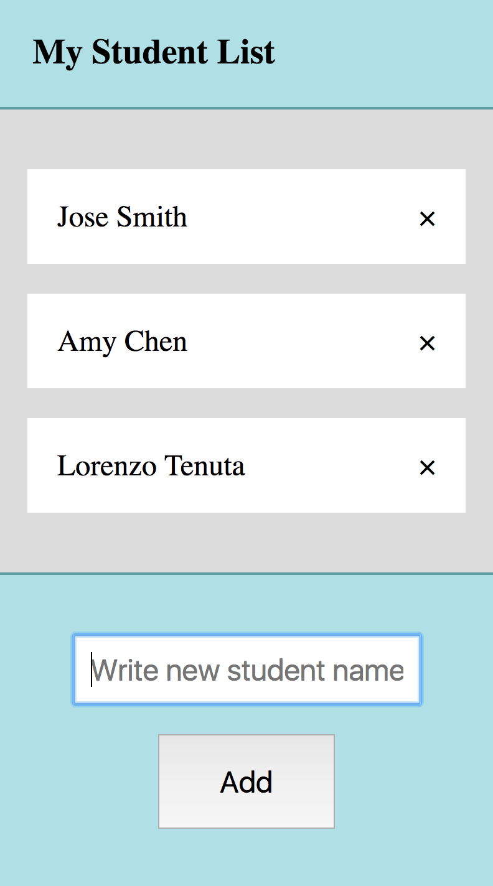
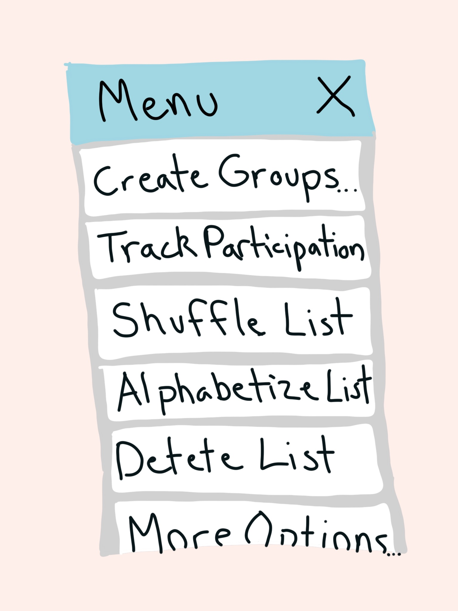
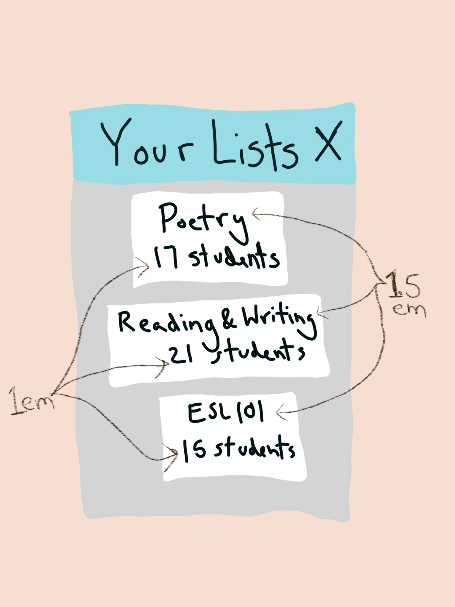

# liESL - Create interactive students lists for your classes
This open-source project is an AngularJS app that allows you to create and edit a student name list. The vision of this app is that it will allow teachers to rapidly create, manipulate, and student name lists on the fly on their tablet, smartphone, or computer while teaching their classes. 

 
 

 
 

## Invitation to contribute
This project is an opportunity for up-and-coming developers to gain experience with styling, JS - including jQuery and AngularJS, and SQL. To get involved, send an introductory to opensourcestudentlist@gmail.com. In the email, share your elevator speech:
  * A little about who you are, where you live, what you do for work, etc.
  * What three things are you most interested in working on: HTML, CSS, Angular, jQuery, Database, Mockups, Utility Functions, Documentation
  * Links to or examples of your dev work
Expect an email with next steps in a day or two.  We welcome new or junior developers as well as more experienced folks.  Please read on for further details.

## Want to learn more?
Go to the <a href="https://github.com/W8sconsin/studentlist/wiki">Wiki</a> for project documents, plans, and user stories.

## Why this app?
This app is meant to make teachers lives easier and to save time in the classroom.  Teachers, language teachers in particular, often create groups in class, keep tally of classroom participation, and other tasks using paper lists.  This can be a pain to keep track of and time consuming.  The app aspire to be a fun and practical solution for the tech-savvy teacher.
